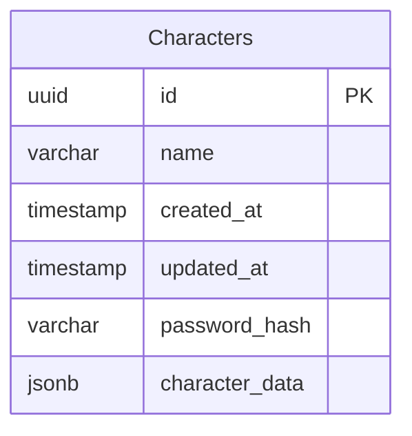

# データモデル設計: Age of Hero システム

**作成日**: 2025-09-08  
**対象**: Age of Hero キャラクターシート管理システム  
**技術**: PostgreSQL + Drizzle ORM + TypeScript  
**設計方針**: 単一テーブル + JSON カラム (シンプルな小規模TRPG向け)

## 設計アプローチ

### 単一テーブル + JSON設計の利点

- **シンプルさ**: 正規化によるJOINクエリを回避
- **開発速度**: 小規模TRPGツールに適したアジャイル開発
- **柔軟性**: キャラクターシート項目の追加・変更が容易
- **パフォーマンス**: 100キャラクター未満の規模では十分
- **デプロイ**: 単純なテーブル構造で運用が簡単

## テーブル構造



## エンティティ定義

### Characters (メインテーブル)

**目的**: キャラクター情報の一元管理

```typescript
interface Character {
  // 基本情報 (テーブル直下カラム)
  id: string; // UUID v4 (PK兼URL識別子)
  name: string; // キャラクター名
  createdAt: Date; // 作成日時
  updatedAt: Date; // 更新日時

  // アクセス制御 (テーブル直下カラム)
  passwordHash?: string; // bcrypt ハッシュ (オプション)

  // キャラクターシート詳細情報 (JSON カラム)
  characterData: CharacterData;
}

// JSON カラム内のデータ構造
interface CharacterData {
  // クラス情報
  selectedClasses: {
    primary: string; // 1つ目のクラス名
    secondary: string; // 2つ目のクラス名 (重複可)
  };

  // 計算済み能力値
  abilities: {
    physical: number; // 肉体
    reflex: number; // 反射
    sensory: number; // 感覚
    intellectual: number; // 知力
    supernatural: number; // 超常
  };

  // 技能値 (初期値 + 割り振りポイント)
  skills: {
    [skillName: string]: {
      baseValue: number; // 初期値 (能力値×10%)
      allocatedPoints: number; // 割り振りポイント
      totalValue: number; // 合計値
    };
  };

  // ヒーロースキル
  heroSkills: {
    [skillName: string]: {
      level: number; // 習得レベル
      maxLevel: number; // 最大レベル
      effect: string; // 効果説明
    };
  };

  // 必殺技
  specialAttacks: {
    [attackName: string]: {
      level: number;
      effect: string;
    };
  };

  // アイテム・装備
  items: {
    [itemName: string]: {
      type: string; // 種別 (武器/防具/消耗品等)
      quantity: number; // 数量
      effects: string[]; // 効果一覧
    };
  };

  // ステータス
  status: {
    hp: number; // 最大HP
    sp: number; // 最大SP
    actionValue: number; // 行動値 (反射×2+知力)
  };

  // セッション履歴
  sessions: {
    id: string; // セッションID (UUID v4)
    sessionName: string; // セッション名
    gmName: string; // GM名
    sessionDate: string; // セッション実施日 (YYYY-MM-DD)
    currentHp: number; // セッション終了時HP
    currentSp: number; // セッション終了時SP
    currentFc?: number; // セッション終了時ファンチット
    experiencePoints: number; // 獲得経験点
    memo?: string; // セッションメモ
    createdAt: string; // 記録作成日時 (ISO string)
  }[];

  // メタデータ
  metadata: {
    version: string; // データ構造バージョン
  };
}
```

**バリデーションルール**:

- id: UUID v4 形式、ユニーク（PK）
- name: 1-50文字、必須
- characterData: JSON スキーマバリデーション
- 能力値: 0-20の範囲
- HP/SP: 正の整数
- sessions: 配列形式

### 静的マスターデータ (コード内定義)

**目的**: ゲームシステム固定データをコード内で管理

```typescript
// クラスマスターデータ (変更頻度が低いためコード内定義)
const CLASSES = {
  マッスル: {
    physical: 3,
    reflex: 2,
    sensory: 2,
    intellectual: 1,
    supernatural: 0,
    hp: 38,
    sp: 17,
  },
  テクノロジー: {
    physical: 1,
    reflex: 2,
    sensory: 3,
    intellectual: 2,
    supernatural: 0,
    hp: 30,
    sp: 25,
  },
  マジカル: {
    physical: 1,
    reflex: 1,
    sensory: 1,
    intellectual: 2,
    supernatural: 3,
    hp: 23,
    sp: 32,
  },
  サイキック: {
    physical: 1,
    reflex: 1,
    sensory: 2,
    intellectual: 2,
    supernatural: 2,
    hp: 25,
    sp: 30,
  },
  バイオ: {
    physical: 2,
    reflex: 2,
    sensory: 2,
    intellectual: 2,
    supernatural: 0,
    hp: 36,
    sp: 19,
  },
  エスペラント: {
    physical: 1,
    reflex: 2,
    sensory: 1,
    intellectual: 2,
    supernatural: 2,
    hp: 27,
    sp: 28,
  },
  アーティファクト: {
    physical: 2,
    reflex: 1,
    sensory: 2,
    intellectual: 1,
    supernatural: 2,
    hp: 34,
    sp: 21,
  },
  アーツ: {
    physical: 1,
    reflex: 3,
    sensory: 2,
    intellectual: 2,
    supernatural: 0,
    hp: 32,
    sp: 23,
  },
} as const;

// 技能マスターデータ
const SKILLS = {
  // 肉体系
  パワー: {
    category: 'physical',
    description: '素手や武器による力任せな攻撃、災害救助など。',
  },
  タフネス: {
    category: 'physical',
    description: 'ダメージへの耐久力、防御、仲間を守るために必要。',
  },
  スタミナ: {
    category: 'physical',
    description: '持久力や回復力。長期任務や連続行動に重要。',
  },
  // 反射系
  技術: {
    category: 'reflex',
    description: '武器や道具を扱う技能。鍛錬次第で応用可能。',
  },
  運動: {
    category: 'reflex',
    description: '回避や素早い運動。人質救出などに役立つ。',
  },
  操縦: {
    category: 'reflex',
    description: '車・船・飛行機などの操縦。現場へ駆けつける手段。',
  },
  // 感覚系
  射撃: {
    category: 'sensory',
    description: '銃や弓による射撃。長距離狙撃やガンカタを含む。',
  },
  知覚: {
    category: 'sensory',
    description: '周囲に気づく力。奇襲への対応など。',
  },
  製作: {
    category: 'sensory',
    description: '武器・道具・乗り物の製作。ギミックを仕込む準備。',
  },
  芸術: {
    category: 'sensory',
    description: '歌や絵画などの創作。人々の心を癒やすことも可能。',
  },
  // 知力系
  情報: {
    category: 'intellectual',
    description: '情報収集や情報戦。敵をかく乱する手段にも。',
  },
  交渉: {
    category: 'intellectual',
    description: '他者との交渉。物資や情報を得る手段。',
  },
} as const;

// ヒーロースキルマスターデータ (一部例)
const HERO_SKILLS = {
  パワードライブ: {
    maxLevel: 7,
    timing: 'メジャーアクション',
    skill: 'パワー',
    target: '単体',
    range: '近接',
    cost: 3,
    effect: 'パワー+レベルで攻撃。成功時追加ダメージ。',
  },
  // ... その他のスキル定義
} as const;
```

### JSON データバリデーション

```typescript
// 共通スキーマ定義
const ClassNameSchema = z.enum([
  'マッスル',
  'テクノロジー',
  'マジカル',
  'サイキック',
  'バイオ',
  'エスペラント',
  'アーティファクト',
  'アーツ',
]);

const AbilityValueSchema = z.number().min(0).max(20);

// バリデーションスキーマ (例: Zod)
const CharacterDataSchema = z.object({
  selectedClasses: z.object({
    primary: ClassNameSchema,
    secondary: ClassNameSchema,
  }),

  abilities: z.object({
    physical: AbilityValueSchema,
    reflex: AbilityValueSchema,
    sensory: AbilityValueSchema,
    intellectual: AbilityValueSchema,
    supernatural: AbilityValueSchema,
  }),

  skills: z.record(
    z.object({
      baseValue: z.number().min(0).max(200),
      allocatedPoints: z.number().min(0).max(100),
      totalValue: z.number().min(0).max(300),
    }),
  ),

  status: z.object({
    hp: z.number().positive(),
    sp: z.number().positive(),
    actionValue: z.number().positive(),
  }),

  sessions: z.array(
    z.object({
      id: z.string(),
      sessionName: z.string(),
      gmName: z.string(),
      sessionDate: z.string(),
      currentHp: z.number(),
      currentSp: z.number(),
      currentFc: z.number().optional(),
      experiencePoints: z.number(),
      memo: z.string().optional(),
      createdAt: z.string(),
    }),
  ),

  metadata: z.object({
    version: z.string(),
  }),
});
```

## データベーススキーマ (Drizzle)

```typescript
// schema.ts - 単一テーブル設計
import {
  pgTable,
  uuid,
  varchar,
  timestamp,
  boolean,
  jsonb,
} from 'drizzle-orm/pg-core';

export const characters = pgTable('characters', {
  // 基本情報
  id: uuid('id').defaultRandom().primaryKey(),
  name: varchar('name', { length: 50 }).notNull(),
  createdAt: timestamp('created_at').defaultNow().notNull(),
  updatedAt: timestamp('updated_at').defaultNow().notNull(),

  // アクセス制御
  passwordHash: varchar('password_hash', { length: 255 }),

  // キャラクターシート詳細 (JSON)
  characterData: jsonb('character_data').notNull().$type<CharacterData>(),
});

// インデックス設定
export const charactersIndexes = {
  updatedAtIdx: index('idx_characters_updated_at').on(characters.updatedAt),
  nameIdx: index('idx_characters_name').on(characters.name),
};
```

## ビジネスロジック

### キャラクター作成フロー

1. **初期化**: 空のcharacterDataオブジェクト作成
2. **クラス選択**: characterData.selectedClasses 設定
3. **能力値算出**: CLASSES定数から計算してcharacterData.abilities設定
4. **技能初期値算出**: 各技能初期値をcharacterData.skills設定
5. **技能ポイント割り振り**: characterData.skillsのallocatedPoints更新
6. **ヒーロースキル選択**: characterData.heroSkills設定
7. **必殺技・アイテム選択**: characterData.specialAttacks, items設定
8. **最終ステータス算出**: characterData.status設定
9. **セッション履歴初期化**: characterData.sessions を空の配列で初期化

### データ更新フロー

```typescript
// セッション記録の追加例
const addSessionRecord = async (
  characterId: string,
  sessionData: {
    sessionName: string;
    gmName: string;
    sessionDate: string;
    currentHp: number;
    currentSp: number;
    currentFc?: number;
    experiencePoints: number;
    memo?: string;
  },
) => {
  const character = await db
    .select()
    .from(characters)
    .where(eq(characters.id, characterId));

  const newSession = {
    id: crypto.randomUUID(),
    ...sessionData,
    createdAt: new Date().toISOString(),
  };

  const updatedData = {
    ...character[0].characterData,
    sessions: [...character[0].characterData.sessions, newSession],
  };

  await db
    .update(characters)
    .set({
      characterData: updatedData,
      updatedAt: new Date(),
    })
    .where(eq(characters.id, characterId));
};

// 最新セッション情報取得
const getLatestSessionStatus = (character: Character) => {
  const sessions = character.characterData.sessions;
  if (sessions.length === 0) {
    return {
      currentHp: character.characterData.status.hp,
      currentSp: character.characterData.status.sp,
      currentFc: 0,
    };
  }

  // 配列は時系列順なので最後の要素が最新
  const latestSession = sessions[sessions.length - 1];

  return {
    currentHp: latestSession.currentHp,
    currentSp: latestSession.currentSp,
    currentFc: latestSession.currentFc || 0,
  };
};

// セッション編集例
const updateSessionRecord = async (
  characterId: string,
  sessionId: string,
  updates: Partial<{
    sessionName: string;
    gmName: string;
    memo: string;
  }>,
) => {
  const character = await db
    .select()
    .from(characters)
    .where(eq(characters.id, characterId));

  const updatedSessions = character[0].characterData.sessions.map((session) =>
    session.id === sessionId ? { ...session, ...updates } : session,
  );

  const updatedData = {
    ...character[0].characterData,
    sessions: updatedSessions,
  };

  await db
    .update(characters)
    .set({
      characterData: updatedData,
      updatedAt: new Date(),
    })
    .where(eq(characters.id, characterId));
};
```

### アクセス制御フロー

1. **キャラクター作成**: id（UUID）自動生成
2. **URL共有**: `/character/{id}` でアクセス
3. **パスワード設定**: isPasswordProtected + passwordHash更新
4. **認証**: パスワード保護時のbcrypt検証

## パフォーマンス最適化

### インデックス戦略

- **Primary Key**: id (UUID) で高速ルックアップ・URL アクセス最適化
- **Regular Index**: updatedAt, name で検索・ソート最適化
- **JSON Index**: PostgreSQL GIN インデックスで JSON 内容検索

```sql
-- JSON内容の検索用インデックス (必要に応じて)
CREATE INDEX idx_character_data_gin ON characters USING GIN (character_data);
CREATE INDEX idx_character_completed ON characters USING BTREE ((character_data->>'metadata'->>'version'));
```

### JSON操作最適化

- **部分更新**: PostgreSQL の jsonb_set() 関数使用
- **バッチ操作**: 複数セクション同時更新で DB アクセス削減
- **バリデーション**: クライアントサイドで事前チェック
- **圧縮**: 大きなJSON データの圧縮保存検討

### マイグレーション戦略

```sql
-- 初期テーブル作成
CREATE TABLE characters (
  id UUID PRIMARY KEY DEFAULT gen_random_uuid(),
  name VARCHAR(50) NOT NULL,
  created_at TIMESTAMP DEFAULT NOW() NOT NULL,
  updated_at TIMESTAMP DEFAULT NOW() NOT NULL,
  password_hash VARCHAR(255),
  character_data JSONB NOT NULL
);

-- インデックス作成
CREATE INDEX idx_characters_updated_at ON characters(updated_at);
CREATE INDEX idx_characters_name ON characters(name);
```

## 利点と制約

**利点**:

- **シンプル**: JOIN 不要で高速、開発・デプロイが簡単
- **柔軟性**: キャラクターシート項目の追加・変更が容易
- **小規模最適**: <100キャラの想定規模に適している
- **アジャイル**: プロトタイプから本格運用への移行が簡単

**制約**:

- **検索制限**: JSON内での複雑クエリは困難
- **正規化なし**: データ重複の可能性
- **パフォーマンス**: JSONサイズ大でクエリが重くなる可能性
- **型安全性**: JSON内でのTypeScript型チェック制限

**推奨事項**:

- 将来的にユーザー数が100を大幅に超える場合は正規化を検討
- JSON内データの検索が頻繁になる場合は部分的正規化を検討
- 現在の小規模TRPG用途には最適な設計

## 設計判断の記録

**決定**: 単一テーブル + JSON カラム設計を採用  
**理由**:

1. 小規模TRPG (10ユーザー未満) に適している
2. 開発速度を優先（アジャイル開発向け）
3. キャラクターシート項目の変更が容易
4. JOINクエリ不要でシンプル

**代替案**: 正規化された複数テーブル設計  
**却下理由**:

1. 小規模アプリには複雑すぎる
2. 開発・運用コストが高い
3. TRPGシートの項目変更時の影響が大きい
